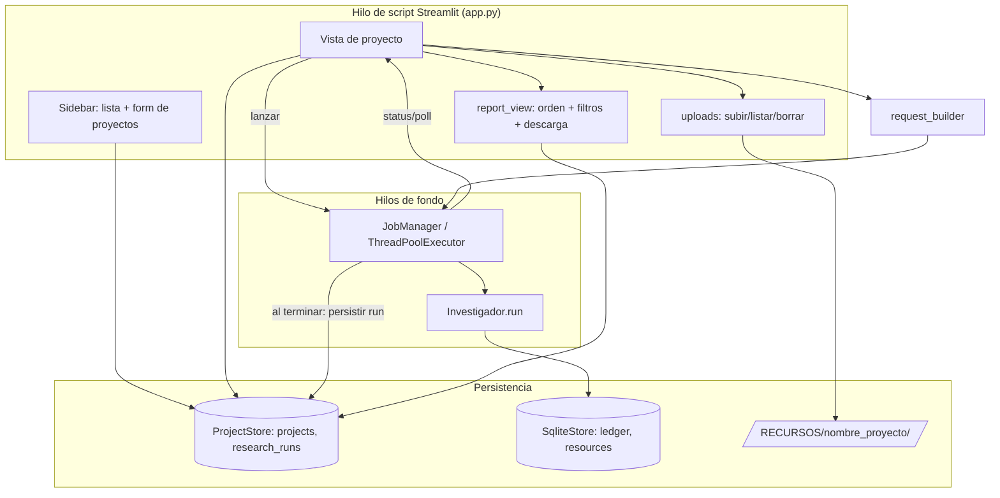

# Design Document — Interfaz Streamlit

## Overview

La interfaz Streamlit es la capa de aplicación (`src/agente_ong/ui/`) que pone el sistema en
manos de usuarios no técnicos. Orquesta el **módulo investigador ya existente**
(`agente_ong.research`, fachada `Investigador`) sin acoplarse a su interior, gestiona
**proyectos** persistidos en SQLite, ejecuta investigaciones de forma **asíncrona** (sin
bloquear la UI) y presenta los resultados con su trazabilidad y estado de verificación,
ordenados y filtrables.

El diseño respeta dos invariantes del proyecto: (1) el investigador sigue siendo **portable**
—la UI lo consume por su interfaz pública y solo se le añaden puntos de extensión opcionales y
retrocompatibles—; y (2) la persistencia es **un único archivo `.db`** que viaja con la app
(tech.md), al que la UI añade sus propias tablas (`projects`, `research_runs`) gestionadas por
un store propio, sin tocar las tablas del investigador.

Tres restricciones de Streamlit gobiernan el diseño de la asincronía:
- El script se **reejecuta de arriba abajo** en cada interacción.
- Hay **un hilo de script por sesión**; los hilos de fondo **no** tienen `ScriptRunContext`,
  así que **no pueden llamar a `st.*`** (solo computar y escribir en estructuras compartidas).
- Las conexiones `sqlite3` son **por hilo** (`check_same_thread`): cada hilo abre la suya.

## Steering Document Alignment

### Technical Standards (tech.md)
- **Streamlit** como capa de UI (subida de archivos, lenguaje natural, descarga) — uso previsto
  en tech.md.
- **SQLite (stdlib)** como persistencia del producto: la UI añade tablas al mismo `.db` que usa
  el investigador (`config.db_path`), sin servicios externos.
- **Abstracción de proveedores intacta**: la UI no conoce Tavily/Firecrawl/BDNS/TED; activa o
  desactiva fuentes por **nombre** a través del `ResearchRequest`, respetando el patrón Strategy
  de `SearchSource`.
- **Sin secretos en la UI**: las claves siguen leyéndose por `ResearchConfig.from_env()` /
  `.env`; la interfaz nunca las muestra ni las pide.
- **Trazabilidad**: se reutiliza tal cual el modelo `Claim`/`SourceRef`/`VerificationStatus`;
  la UI solo lo presenta.

### Project Structure (structure.md)
- Código en `src/agente_ong/ui/` (carpeta `ui/` ya prevista en structure.md).
- Convención `RECURSOS/[nombre_proyecto]/` de cumplimiento obligatorio para los documentos que
  sube el humano (R3); `RECURSOS/ENTRENAMIENTO/` permanece como destino del investigador.
- Tests en `tests/ui/`, reflejando la estructura de `src/`.
- `snake_case` para módulos y funciones, `PascalCase` para clases.

## Code Reuse Analysis

### Existing Components to Leverage
- **`Investigador` (research/investigador.py)**: punto de entrada. La UI lo instancia por
  trabajo y llama a `run(request) -> ResearchReport`. Soporta `with` (cierra el store).
- **`ResearchRequest` / `ResearchConfig`**: ya soportan `max_depth` y `max_pages` como override
  → cubren R8 sin cambios. Se les añaden campos opcionales y retrocompatibles para R9/R10.
- **`ResearchReport`, `GrantOpportunity`, `Claim`, `SourceRef`, `VerificationStatus`,
  `Unresolved`, `FailedSource`**: el modelo de salida que la UI ordena, filtra y renderiza
  (R4, R11). No se modifican.
- **`SqliteStore` (research/store/sqlite.py)**: patrón de referencia (WAL, `foreign_keys=ON`,
  consultas parametrizadas) que `ProjectStore` imita. Comparten archivo `.db`, no tablas.
- **`TedSource.min_year`**: ya implementa el filtro temporal; R10 lo replica en `BdnsSource`.
- **`SearchSource.supports()` / `name`**: base para activar/desactivar fuentes por nombre (R9).

### Integration Points
- **Módulo investigador**: la UI lo consume y le añade puntos de extensión (ver "Cambios
  requeridos en el módulo investigador"). Todos opcionales y con default que preserva el
  comportamiento actual.
- **Base de datos (`config.db_path`)**: `ProjectStore` crea `projects` y `research_runs` en el
  mismo archivo; el investigador sigue dueño de sus tablas.
- **Sistema de archivos**: `uploads` escribe bajo `RECURSOS/[nombre_proyecto]/`; el investigador
  sigue escribiendo material de entrenamiento bajo `RECURSOS/ENTRENAMIENTO/`.

## Architecture

La UI separa **presentación** (Streamlit, hilo de script) de **trabajo** (hilos de fondo) y de
**persistencia** (stores con conexión propia por hilo). El estado de los trabajos vive en un
`JobManager` singleton de proceso; los resultados se persisten en SQLite para sobrevivir a la
pérdida de sesión.



**Flujo de una investigación asíncrona (R2):**
1. El usuario configura criterios + nivel + fuentes + año + URLs y pulsa "Investigar".
2. `request_builder` traduce los controles a `(ResearchConfig, ResearchRequest)`; el
   `search_context` NO es un control del formulario: se hereda del proyecto
   (`project.search_context`, con default si está vacío — R13).
3. `JobManager.submit(project_id, config, request)` crea un `Job` (estado `running`) en un hilo
   de fondo y **devuelve de inmediato**. El hilo abre su **propio** `Investigador` (su conexión
   SQLite) y ejecuta `run()`.
4. La UI, en cada rerun (refresco periódico con `st_autorefresh` mientras haya jobs activos),
   lee el estado del `JobManager` y muestra "en progreso" sin bloquearse.
5. Al terminar, el hilo serializa el `ResearchReport` y lo persiste como `research_run`
   (`done`/`error`) vía `ProjectStore` (conexión del hilo de fondo). La UI lo recoge en el
   siguiente rerun y lo renderiza.

## Components and Interfaces

### `ui/app.py` — Entry point y layout
- **Purpose:** punto de arranque de Streamlit; navegación (sidebar con lista/creación de
  proyectos + vista del proyecto seleccionado); dispara el autorefresh mientras haya jobs vivos.
- **Interfaces:** `main()`; `run: streamlit run src/agente_ong/ui/app.py`.
- **Dependencies:** todos los componentes `ui/*`, `st_autorefresh`.
- **Reuses:** `ResearchConfig.from_env()` para construir la config base.
- **R13:** el formulario de alta de proyecto añade el campo "¿Qué tipo de organización sois y
  cuál es vuestro ámbito?" (texto libre, opcional), con placeholder de ejemplo:
  `p.ej. "fundación cultural en Andalucía" o "ONG de cooperación internacional"`. La
  constante `_SEARCH_CONTEXT` se ELIMINA de `app.py`: al lanzar, se pasa
  `project.search_context` a `request_builder.build(...)` (el default vive en
  `request_builder.DEFAULT_SEARCH_CONTEXT`). El formulario de investigación no cambia (R13.4).

### `ui/project_store.py` — `ProjectStore`
- **Purpose:** CRUD de proyectos e historial de investigaciones en SQLite (tablas `projects`,
  `research_runs`), en el mismo `.db` del investigador.
- **Interfaces:**
  - `create_project(name, objective, search_terms, search_context="") -> Project` (R13)
  - `list_projects() -> list[Project]` · `get_project(id) -> Project | None`
  - `save_run(run: ResearchRun) -> int` · `update_run_status(id, status, report?, error?)`
  - `list_runs(project_id) -> list[ResearchRun]`
- **Dependencies:** `sqlite3`, `report_serde`. Conexión propia **por hilo** (la UI y los hilos
  de fondo no comparten conexión).
- **Reuses:** patrón y PRAGMAs de `SqliteStore` (WAL, parametrización).

### `ui/jobs.py` — `JobManager`
- **Purpose:** ejecutar investigaciones en segundo plano y exponer su estado de forma
  thread-safe (R2); aislar fallos (R2.4) para no tumbar la app.
- **Interfaces:**
  - `submit(project_id, config, request) -> job_id`
  - `status(job_id) -> JobStatus` · `active_jobs() -> list[Job]` · `pop_finished() -> list[Job]`
- **Dependencies:** `concurrent.futures.ThreadPoolExecutor`, `threading.Lock`, `Investigador`,
  `ProjectStore`. **No llama a `st.*`** (regla de hilos de Streamlit).
- **Reuses:** `Investigador` (un objeto nuevo por job, su propia conexión). Singleton de proceso
  vía `st.cache_resource` para sobrevivir a los reruns.

### `ui/request_builder.py` — Mapeo UI → módulo
- **Purpose:** traducir controles de UI a `ResearchConfig` + `ResearchRequest` (R8, R9, R10,
  R13).
- **Interfaces:**
  - `DEPTH_PRESETS: dict[str, tuple[int, int]]` (rápida/normal/exhaustiva → (max_depth, max_pages))
  - `DEFAULT_SEARCH_CONTEXT = "convocatoria de subvención para organizaciones sin ánimo de
    lucro"` (R13.3; vive aquí, no en la base de datos: un `search_context` vacío se resuelve
    al default EN EL LANZAMIENTO, así el default puede evolucionar sin migrar datos)
  - `build(base_config, *, terms, scope, depth_level, min_year, enabled_sources, direct_urls,
    search_context) -> tuple[ResearchConfig, ResearchRequest]` — `search_context` vacío o
    None ⇒ `DEFAULT_SEARCH_CONTEXT`
- **Dependencies:** modelos del investigador.
- **Reuses:** overrides `max_depth/max_pages` ya existentes en `ResearchRequest`.

### `ui/report_serde.py` — Serialización de informes
- **Purpose:** `ResearchReport ⇄ dict/JSON` para persistir runs y para la descarga (R7).
- **Interfaces:** `report_to_dict(report) -> dict` · `report_from_dict(d) -> ResearchReport` ·
  `report_to_markdown(report) -> str` (descarga detallada, R7) ·
  `report_to_markdown_summary(report) -> str` (descarga resumida, R22) ·
  `opportunity_numbers(report) -> dict[int, int]` (R14, nueva) ·
  `format_verification_date(retrieved_at) -> str` (R15, nueva).
- **Dependencies:** modelos del investigador, `json`, `datetime`.
- **Reuses:** estructura de `ResearchReport`/`Claim`/`SourceRef` (incluye `status`, `sources` y
  `retrieved_at`).
- **R14/R15:** ver "Extensión UI-34/UI-35" más abajo.

### `ui/report_view.py` — Render, orden y filtros
- **Purpose:** presentar convocatorias ordenadas por verificación y filtrables (R4, R11),
  estados como badges legibles, `unresolved`, `failed_sources`, botón de descarga (R7), número
  visible por convocatoria (R14) y trazabilidad de URL con fecha (R15).
- **Interfaces (funciones puras testeables, separadas del render):**
  - `sort_opportunities(opps) -> list[GrantOpportunity]` (orden VERIFIED → … → NOT_FOUND)
  - `filter_opportunities(opps, *, status?, min_year?, min_amount?) -> list[...]`
  - `partition_by_actionability(opps) -> (accionables, informativos)` (R20.2)
  - `render_report(report, ...)` (capa Streamlit, fina)
- **Dependencies:** `VerificationStatus`, `report_serde` (`opportunity_numbers`,
  `format_verification_date`, `report_to_markdown*`), Streamlit (solo en `render_*`).
- **Reuses:** `VerificationStatus` para el orden canónico.
- **R14/R15:** ver "Extensión UI-34/UI-35" más abajo.

### Extensión UI-34/UI-35 — numeración estable y trazabilidad de URL (R14/R15)

**Decisión de diseño clave (numeración):** el número de una convocatoria NO se calcula sobre
la lista que ve el usuario (ordenada por fiabilidad y opcionalmente filtrada), porque esa lista
cambia de orden/contenido con cada interacción. Se calcula sobre `report.opportunities` — el
orden en que el investigador construyó el informe, que es el mismo orden que se persiste y
recarga (`report_to_dict`/`report_from_dict` preservan listas) — filtrando `result_type !=
"documento_informativo"` (R20.2) y numerando 1..N. Así la pantalla, el Markdown resumido y el
Markdown detallado SIEMPRE coinciden, y un filtro de la UI solo OCULTA números, nunca los
reasigna.

- **`opportunity_numbers(report) -> dict[int, int]`** (nueva, en `report_serde.py`): mapea
  `id(opportunity) -> número` (1..N) para las convocatorias accionables, en el orden de
  `report.opportunities`. Se usa `id()` porque `GrantOpportunity` no es hashable (dataclass con
  `eq=True`); el mapeo se recalcula en cada render/generación de Markdown a partir del MISMO
  `report`, así que los `id()` son válidos dentro de esa llamada (`sort_opportunities` /
  `filter_opportunities` / `partition_by_actionability` devuelven listas reordenadas de los
  MISMOS objetos, nunca copias).
- **`report_to_markdown_summary`**: pasa a numerar con `opportunity_numbers(report)` en vez de
  un `enumerate(actionable, start=1)` local (mismo resultado hoy; garantiza que no diverja del
  detallado ni de la UI si el orden de partición cambiara en el futuro).
- **`report_to_markdown`** (detallado): se reestructura para separar accionables/informativos
  igual que la resumida (R20.2) — hasta ahora numeraba TODOS los `opportunities` (incluidos los
  informativos) en una sola lista, lo que rompería la correspondencia de números con la
  resumida y la UI. Ahora: sección "Convocatorias (N)" con accionables numerados vía
  `opportunity_numbers`, y nueva sección "Material informativo (no convocatorias)" (título +
  URL) igual que la resumida.
- **`render_report`**: calcula `numbers = opportunity_numbers(report)` ANTES de
  `sort_opportunities`/`filter_opportunities`; cada expander muestra `f"{numbers[id(opp)]}. "`
  como prefijo de su cabecera. El material informativo no lleva número (R14.4).

**Trazabilidad de URL (R15):**
- **`format_verification_date(retrieved_at: datetime) -> str`** (nueva, en `report_serde.py`):
  `retrieved_at.strftime("%d-%m-%Y")`.
- **`url_verification_suffix(claim: Claim) -> str`** (nueva, en `report_serde.py`, **pública**):
  si `claim.sources` está vacío devuelve `""`; si no, devuelve `" (verificada el
  DD-MM-AAAA[, DD-MM-AAAA...])"` con una fecha por cada `SourceRef` (sin deduplicar fechas
  iguales: tras R14 lo habitual es una sola fuente → una sola fecha). Pública porque
  `report_view.py` (UI) la importa para mostrar la fecha de verificación junto a la URL (R15).
- Se aplica SOLO al campo `url` (no al resto de `Claim` de la convocatoria): en
  `report_to_markdown_summary` (línea "URL"), en `_claim_line` del detallado (cuando
  `claim.field == "url"`), y en `render_report` (fila "URL" de `_CLAIM_ROWS`).
- Sin llamadas de red nuevas (R15.4): el dato viene de `SourceRef.retrieved_at`, ya presente en
  el informe persistido.

**Duplicación conocida (sin resolver aquí):** `report_serde.py` ya repite el filtro
`result_type != "documento_informativo"` que también vive en
`report_view.partition_by_actionability` (para evitar el ciclo de imports `report_view →
report_serde`); `opportunity_numbers` repite el mismo filtro una vez más. Sigue anotado en el
roadmap para extraerse a un helper compartido en v1.1; no se resuelve en esta mini-extensión
para no ampliar su alcance.

### `ui/uploads.py` — Documentos de la ONG
- **Purpose:** guardar/listar/borrar documentos del proyecto bajo `RECURSOS/[nombre_proyecto]/`
  (R3), con validación de tipo/tamaño y **sin path traversal**.
- **Interfaces:**
  - `project_dir(name) -> Path` (normaliza y valida que queda dentro de `RECURSOS/`)
  - `save_upload(name, filename, data) -> Path` · `list_documents(name) -> list[Path]` ·
    `delete_document(name, filename) -> None`
- **Política concreta (confirmada):**
  - Extensiones permitidas (whitelist): **PDF, DOCX, TXT, JPG, PNG**.
  - Tamaño máximo: **10 MB** por archivo (`MAX_UPLOAD_BYTES = 10 * 1024 * 1024`).
  - Colisión de nombre: **renombrado automático** `nombre (2).ext`, `nombre (3).ext`, … (sin
    sobrescribir, sin pedir confirmación).
- **Dependencies:** `pathlib`. Whitelist y tamaño como constantes del módulo.
- **Reuses:** convención `RECURSOS/` de structure.md.

### Cambios requeridos en el módulo investigador (mínimos y retrocompatibles)
Para soportar R9 y R10 desde la UI sin romper portabilidad:

1. **`ResearchRequest`** (research/models.py) — dos campos opcionales:
   - `enabled_sources: set[str] | None = None` (None = todas; si no, filtra por `source.name`).
   - `direct_urls: list[str] = field(default_factory=list)` (URLs a leer directamente con fetch).
2. **`ResearchGraph`** (research/graph.py):
   - `search()` y `read_deep()` filtran `self._sources` por `request.enabled_sources` cuando no
     es None (match por `name`).
   - `read_deep()` **siembra la frontera** con `request.direct_urls` en el nivel 1 (además de los
     hits), de modo que se lean con Firecrawl aunque no provengan de una búsqueda (R9.1, R9.4).
3. **`ResearchConfig`** (research/config.py) — `min_year: int | None = None` (+ `RESEARCH_MIN_YEAR`
   en `from_env`).
4. **`_default_sources`** (research/investigador.py): `TedSource(min_year=config.min_year or
   (datetime.now().year - 1))` y `BdnsSource(config, min_year=config.min_year)`.
5. **`BdnsSource`** (research/sources/bdns.py): añadir `min_year: int | None = None`; en
   `_to_hits`, descartar convocatorias cuyo año de `fechaRecepcion` sea < `min_year`. Los hits
   sin fecha parseable **se conservan** (no se inventa antigüedad). *Verificar en implementación
   el formato real de `fechaRecepcion` con una llamada en vivo, como se hizo con TED/BDNS.*

> Decisión de diseño: **profundidad** (R8) y **fuentes/URLs** (R9) viajan en `ResearchRequest`
> (varían por investigación); **min_year** (R10) viaja en `ResearchConfig` porque las fuentes se
> construyen con él y `TedSource` ya lo hace así. El worker crea config+request por job, así que
> ambos caminos conviven sin coste extra. *Alternativa considerada:* poner `min_year` en
> `SearchQuery` (como `search_context`) y leerlo en TED/BDNS; se descarta para no refactorizar la
> firma ya estable de `TedSource`.

## Data Models

### Project
```
Project
- id: int (PK autoincrement)
- name: str (UNIQUE, no vacío; válido como nombre de carpeta)
- objective: str
- search_terms: list[str]   # persistido como JSON
- search_context: str       # R13: tipo de organización y ámbito, en lenguaje no técnico;
                            # "" = usar el default en el momento de lanzar (no se persiste
                            # el default, así puede evolucionar sin migrar datos)
- created_at: datetime (ISO-8601 UTC)
```

### ResearchRun
```
ResearchRun
- id: int (PK autoincrement)
- project_id: int (FK -> projects.id, ON DELETE CASCADE)
- status: "running" | "done" | "error"
- created_at: datetime
- finished_at: datetime | None
- params_json: dict        # nivel de profundidad, min_year, fuentes activas, urls directas
- report_json: dict | None # ResearchReport serializado (report_serde) cuando status="done"
- error: str | None        # mensaje cuando status="error"
```

### Esquema SQLite (tablas nuevas, mismo `.db`)
```sql
CREATE TABLE IF NOT EXISTS projects (
    id              INTEGER PRIMARY KEY AUTOINCREMENT,
    name            TEXT NOT NULL UNIQUE,
    objective       TEXT NOT NULL DEFAULT '',
    terms_json      TEXT NOT NULL DEFAULT '[]',
    search_context  TEXT NOT NULL DEFAULT '',   -- R13 (añadida por migración en bases previas)
    created_at      TEXT NOT NULL
);
CREATE TABLE IF NOT EXISTS research_runs (
    id           INTEGER PRIMARY KEY AUTOINCREMENT,
    project_id   INTEGER NOT NULL REFERENCES projects(id) ON DELETE CASCADE,
    status       TEXT NOT NULL,
    created_at   TEXT NOT NULL,
    finished_at  TEXT,
    params_json  TEXT NOT NULL DEFAULT '{}',
    report_json  TEXT,
    error        TEXT
);
CREATE INDEX IF NOT EXISTS idx_runs_project ON research_runs(project_id);
```

**Migración (R13.5):** las bases creadas antes de R13 tienen `projects` sin
`search_context`. `ProjectStore._ensure_schema` comprueba las columnas reales
(`PRAGMA table_info(projects)`) y, si falta, ejecuta
`ALTER TABLE projects ADD COLUMN search_context TEXT NOT NULL DEFAULT ''`. Idempotente
(no re-altera si ya existe), no toca filas existentes (heredan `''` = default en
lanzamiento) y no afecta a las tablas del investigador.

### Job (en memoria, no persistente)
```
Job
- id: str (uuid)
- project_id: int
- status: "running" | "done" | "error"
- future: concurrent.futures.Future
- run_id: int | None   # id en research_runs una vez persistido
```

## Error Handling

### Error Scenarios
1. **Investigación en segundo plano falla (excepción no controlada en `run`)**
   - **Handling:** el `JobManager` captura la excepción del `Future`, marca el job `error` y
     persiste `research_runs.status='error'` con el mensaje. Los demás jobs y proyectos siguen.
   - **User Impact:** el proyecto muestra "La investigación falló: <motivo>" y permite reintentar.

2. **Fuente concreta falla (timeout/HTTP)**
   - **Handling:** ya lo gestiona el investigador (`failed_sources`); no aborta el run.
   - **User Impact:** badge "Fuentes con problemas: TED" junto a los resultados disponibles (R4.4).

3. **Sin fuentes activas ni URLs directas (R9.5)**
   - **Handling:** `request_builder`/UI valida antes de `submit`; no se crea job.
   - **User Impact:** mensaje "Activa al menos una fuente o indica una URL".

4. **Subida insegura o inválida (R3.2/R3.3)**
   - **Handling:** `uploads.project_dir` normaliza (`resolve`) y verifica que el destino queda
     dentro de `RECURSOS/`; rechaza extensión fuera de {PDF, DOCX, TXT, JPG, PNG} o tamaño > 10
     MB; ante colisión, renombra automáticamente (`nombre (2).ext`).
   - **User Impact:** "Archivo rechazado: tipo no permitido / supera 10 MB" o aviso de renombrado.

5. **Nombre de proyecto duplicado o inválido (R1.4)**
   - **Handling:** `UNIQUE` en `projects.name` + validación de caracteres; no se crean carpetas.
   - **User Impact:** "Ya existe un proyecto con ese nombre" / "Nombre no válido".

6. **Conexión SQLite usada entre hilos**
   - **Handling:** cada hilo (UI y cada worker) abre su propia conexión; nunca se comparte un
     `Investigador`/`ProjectStore` entre hilos. El singleton compartido es solo el `JobManager`
     (con `Lock`).
   - **User Impact:** ninguno (evita el `ProgrammingError` de sqlite por diseño).

## Testing Strategy

### Unit Testing
- **`request_builder`**: presets de profundidad → `(max_depth, max_pages)`; propagación de
  `min_year`, `enabled_sources`, `direct_urls`, `search_context`; contexto vacío/None →
  `DEFAULT_SEARCH_CONTEXT`, contexto del proyecto → llega tal cual al `ResearchRequest` (R13).
- **`report_serde`**: round-trip `report_to_dict`/`report_from_dict` preservando `Claim.status`,
  `SourceRef`, `unresolved`, `failed_sources`; `report_to_markdown` incluye fuente y estado.
- **`report_view`**: `sort_opportunities` respeta el orden canónico de `VerificationStatus`;
  `filter_opportunities` por estado/fecha/importe, con manejo correcto de `value is None`.
- **`report_serde` (R14/R15):** `opportunity_numbers` numera 1..N solo las convocatorias
  accionables, en el orden de `report.opportunities`, sin numerar `documento_informativo`;
  `report_to_markdown` y `report_to_markdown_summary` usan los mismos números entre sí; el
  detallado separa "Material informativo" igual que la resumida; `format_verification_date`
  da "DD-MM-AAAA"; la línea "URL" incluye "(verificada el ...)" cuando `Claim.sources` no está
  vacío, y se omite sin inventar fecha cuando está vacío.
- **`report_view` (R14):** `render_report` muestra el número de cada expander; el número NO
  cambia al aplicar `sort_opportunities`/`filter_opportunities` (se calcula antes, sobre
  `report.opportunities`).
- **`uploads`**: rechazo de path traversal (`../`, rutas absolutas), tipo/tamaño, colisión de
  nombres; escritura dentro de `RECURSOS/[proyecto]/` (con `tmp_path`).
- **`project_store`**: CRUD de `projects`/`research_runs`, `UNIQUE(name)`, cascade, persistencia
  de `report_json`; round-trip de `search_context` y MIGRACIÓN (abrir una base creada con el
  esquema antiguo, sin la columna, no rompe y la añade — R13.5).
- **Cambios en el investigador**: `enabled_sources` filtra por nombre; `direct_urls` se leen vía
  fetch aun sin hits (con fakes `FakeSearchSource`/`FakeFetchSource` ya existentes);
  `BdnsSource(min_year=...)` descarta antiguas y conserva las sin fecha (con `_FakeHttp`).

### Integration Testing
- **JobManager end-to-end** con un `Investigador` fake (o real con fuentes fake) y un
  `ProjectStore` sobre `tmp_path`: `submit` → polling de estado → run persistido `done`; y un
  caso que lanza excepción → `error` persistido, sin afectar a otros jobs.
- **Aislamiento entre hilos**: dos jobs concurrentes con conexiones SQLite independientes.

### End-to-End Testing
- **`streamlit.testing.v1.AppTest`** (smoke): arrancar `app.py`, crear proyecto, ver que aparece
  en la lista; lanzar investigación con fuentes fake inyectadas y comprobar el render del informe
  ordenado/filtrado. La lógica pesada se prueba en los unit tests; el E2E valida el cableado.
- **R14/R15:** la etiqueta del expander de la convocatoria empieza por "1. "; el render incluye
  "verificada el" con una fecha en formato DD-MM-AAAA junto a la URL.
```
